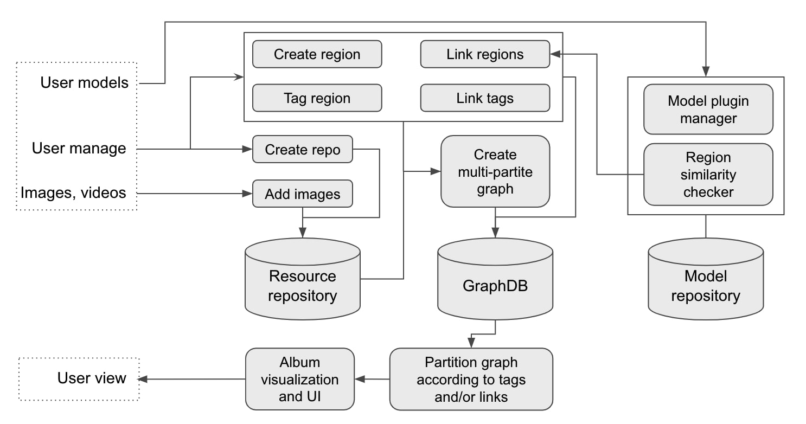

# Album Graph

This repository provides an implementation for **Album Graph**, which is a framework based on an alternated property graph model incorporating with arbitrary plugins of AI models for organizing multimedia resources, such as photos/videos, in various ways. Alubm graph offers an innovative approach to support semantic photo search/recommendation, style based photo organized, and more.

## Motivation

Due to recent advances in mobile devices, many cellphones install more and more advanced cameras and super large cloud storage, making a cellphone perfect for taking pictures/videos. However, seeking a picture you want from tons stored on cloud is not less painful than finding a needle in haystack. Some apps provide methods to relieve the headache to some extent by organizing pictures according to the faces, things, locations, or types of media. However, this is far from solving a simple query like finding the picture with a dog walking on a beach, not to mention queries like finding pictures of my kids' drawing. 

The development of AI makes it not impossible to build a framework of smarter albums. For example, the scene graph model in recent research of computerv version helps pull out relationship among objects within a picture; various DNN implements automatic feature extraction representing overall similarity between pictures. All such techniques senses certain features helps to organize a corpse of photos in a way, essentially revealing connections among the resources/photos. The richness of AI models determines how much insight we can obtain. When keeping all such detected connections together, with enhancement of reasoning, we are able to support new ways to (re-)organize photos upon a user's query.  

## Related work

A relevant work that forms as the base of the proposed technique is an early work proposed by Singh *et. al.* [1], where the metadata is retrieved from a group of photos from personal albums. The metadata is utilized for query and/or grouping, so that enhanced interaction can be potentially built between a user and the images by exploring various dimensions of the information beyond these images. This is called reliving on demand. 

A possible tool to capture heterogeneous information in graph analysis is called heterogeneous information network (HIN) (see [2]), where an expressive data model is constructed to extend the power of graph analysis, so that heterogeneous information can be managed in a straightforward manner. 

Graph database has been a perfect choice to manage various "connections" among a group of entities, such as the photos and videos in this scenario [3]. There are several open source and/or commercial products of graph database, such as Neo4j, JanusGraph, TigerGraph, DSE Graph, AWS Neptune, IBM Graph, Azure Cosmos, and Huawei's Graph engine service (GES).

## Album Graph Engine Design

### Goal

The goal of album graph engine design is to provide: (1) a data representation and management for *generic heterogeneous graphs*, so that the images/videos can be efficiently queried according to various meta data, such as the tags of recognized objects in an image and their possible relationship among the objects. (2) The engine shall also support recommendations according to the *similarity* of given images, such as the same person, the similar category, the proxity of shooting time, etc. (3) In the meanwhile, the *anomaly* can be detected by the engine to figure out the most "unusual" images in an album.

### Data representation for Semantic Search

The framework of an album graph organizes resources (e.g. photos) as a layered network (a.k.a. multi-partite graph) with possible internal connections. It basically consists of three layers, the _resource layer_, the _region layer_, and the _tag layer_. Each layer is a set of entities of the same *type*, i.e. photos, regions (e.g. bounding boxes), and tags.

We organize entities in the above approach for the following purpose: The resource layer is to facilitate the album management by associating physical files to the regions. a photo can include one or more regions, separate or overlapping. When no region is specified, the system creates a single region that covers the whole area of a picture. Each region must be tagged, where a tag is represented as a node in the tag layer. The tag is essentially a label to a region, a categorical variable or a numberic value to describe some property. For example, a region can be tagged as a face with a person's name.

The connections among entities come twofold: the connection between entities across layers is straightforward -- if a region is within a photo, they are connected; if a region is connected to a tag if so it is labelled; the connection between entities of the same layer mainly occurs at the layer of regions. Two regions are connected according to users' instructions. Typically, it is based on the prediction of a model provided by users for measuring the similarity/distance between two regions, based on whatever features they have. Tags can be connected if an ontology of tags is provided, according to which a tag is a type of (isA) the other tag.

### Generic Heterogeneous Graph Management Engine

We extend the above data representation to support arbitrary heterogeneous graph. a.k.a. heterogeneous information network. Formally, such a graph is defined as follows:

**Heterogeneous graph**: Given a set of entities tagged as of  types denoted by  where  represents the set of distinct entities of the *t*th type, a graph  is called a heterogeneous graph, where  is a set of binary interactions of entities and each interaction can be tagged or annotated with attributs for enhanced model expressiveness. 

In the following figure originally published in [1], several metadata of an image extracted out for media management. If under the heterogeneous graph model, each type of the metadata form a set of vertices . Note that the edges can be between any two vertices in the graph. Therefore, it describes the relationship of two vertices within the same type or across different types. An example of relationship within the same type can be two objects in the same image e.g. a man riding on a horse, and the that across two types can be a location and an image taken at that spot.  

**Entity retrieval**: Given a set of information retrievals , where  can be as simple as a module to extract the size/dimension of an image, or as complex as a computer vision model to detect an object from an image, we have , where *I* is a given input image and the output is a set of entity instances of types , , etc. The image and the retrieved entities are added to a heterogeneous graph , each being a vertex of corresponding tags.

According to the definition of entity retrieval, we can see it constructs a heterogneous graph. Note that the image itself can be simply tagged as a raw file; while the rest entities' tags are all identified by the models. We can have abitrary retrieval models, and therefore the heterogeneity of the graph can be upscaled freely.  The edges can be inserted accordingly. For example, when the location information is extracted out from an image by an entity retrier, the entity representing the location, either existent or newly created, shall be linked to the entity representing the image file. 

**Grouping, Ranking and Recommendation**: According to [2], various graph analysis algorithm can be applied to a heterogeneous graph, based specified types of vertices/edges. Essentially, it filters a graph using the tags and perform the corresponding graph algorithm on the resultent graph. For example, a cohensive subgraph detection can help find a group of images with similarity according to specified types. This operation helps form albums from a collection of media according to some complex conditions, such as a small group of images selected by users. Even simplier than performing analysis, directly traverse a graph also leads to meaningful albums. For example, we can form a set of albums based on the locations by simply querying image entities starting from each entity representing a location. Similarly, we can perform PageRank or its many variant schemes to ranking images for recommendtion.

**Anomaly detection**: To further tune the quality of an album, we score an album according to the affinity of the images within an album. THe affinity is definied interactively by users through a set of selected types of vertices. We can improve the affinity by identifying a set of abnormal images, utilizing graph-based anomaly detection algorithms, such as the graph-based LoF algorithm that detects outliers.  

Due to the expressiveness of heterogeneous graph, more advanced operators can be definied online, and applied to the images to form various albums interactively. 

## Framework architecture

Here is the architecture of the Album Graph that supports the data representation and operations mentioned above. 

To construct an album graph, a user first needs to create a photo repository to store raw input photo files. Note that multiple albums can be created upon a photo repository. Basically, the photo repository defines the scope of resources a user will work on. In addition to the _photo respositary_, the framework of album graph provides a _graph database_ to store metadata within or across pictures, and _model repository_ to store machine learning models for processing photos. 

After a resource repository is created, a user can *add images (photos)* into the repository. For each inserted photo, the framework of album graph allows a user to define a region (*create region*) or mulitple regions towards a photo; if not, the entire area of a photo form a single default region. Besides, the framework also accepts tags from users to label each region (*tag region*). A region can be labeled with multiple tags. The regions are used to construct graphs (*create mutli-partite graph*), along with the resource URI and the set of user defined tags. The graph creation first forms a three layered graph according to the above three categories of entiries, where each URI, region, or tag is represented as an entity, and links are built between an URI and a region, and between a region and its tags. 

Links among entities of the same category can also be insert by users (*link region*) or automatically. For automatically link, it relies on the *region similarity checker* managed by the *mdoel plugin manager*, which invokes a model stored in the model repository to check the similarity of given pairs of regions. A link is added if a pair of regions pass the checking. 

## Reference

- [1] Vivek K. Singh, Jiebo Luo, Dhiraj Joshi, Phoury Lei, Madirakshi Das, Peter O. Stubler: *Reliving on demand: a total viewer experience*, ACM Multimedia, 2011
- [2] Chuan Shi, Yitong Li, Jiawei Zhang, Yizhou Sun, Philip S. Yu: A Survey of Heterogeneous Information Network Analysis, IEEE Trans. on Knowledge and Data Engineering, Vol 29 Issue 1, 2017
- [3] Li Zhou, Yinglong Xia, Hui Zang, Jian Xu, Mingzhen Xia: An edge-set based large scale graph processing system. BigData 2016: 1664-1669
