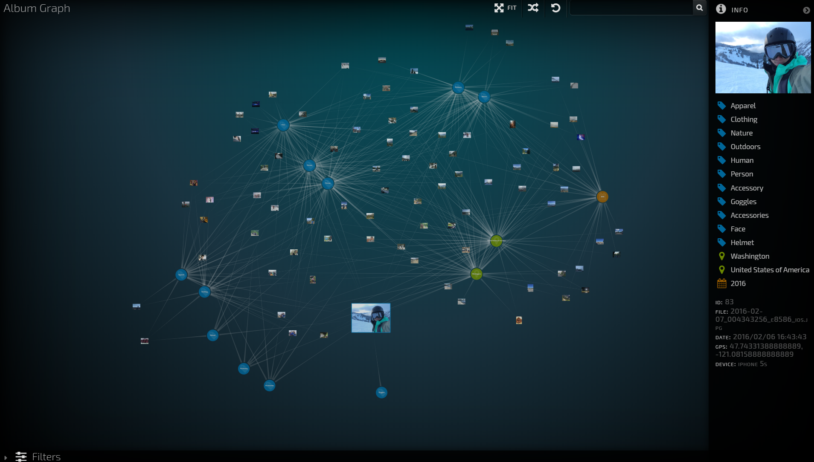

# Album graph demo


## Requirements
---------------------------------------------
Python 2.7
Gremlin-server3.4.1(Local Graph Database)
Node.js(frontend)

## Dependency
---------------------------------------------
* numpy
* scipy
* sklearn
* matplotlib
* PIL
* geopy
* urllib3
* certifi
* requests
* datetime
* mpl_toolkits
* flask
* jsonify


## Usage
---------------------------------------------
1.Start gremlin server(port 8182)
```bash
cd apache-tinkerpop-gremlin-server-3.4.1
bin/gremlin-server.sh conf/gremlin-server-modern.yaml
```
2.Prepare the data
```bash
cd gremlin_server
```
Get CV detection result from white zone server:
```bash
 python client_test.py
```
Cluster face with face feature:
```bash
 python rank-order_distance_cluster.py
```
Cluster event with image exif information:
```bash
 python event_cluster_Hierarchical.py
```
Clean and import existing data
```bash
 python clean.py
```
Start backend server(port 7070)
```bash
 python server.py
```
3.Setup frontend web app(port 8082)
```bash
cd frontend
npm install
npm start
```
4.Now you should be able to access Album graph demo(via  http://localhost:8082/)
