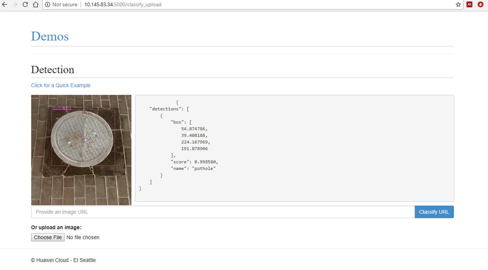

# Web Demo

This is a simple web demo for object detection using Detectron and based on Flask

# Run the Demo with Command Line
## Requirements

The demo server requires Python with some dependencies.
To make sure you have the dependencies, please run `pip install -r examples/web_demo/requirements.txt`, and also make sure that you've compiled the Python Caffe interface and that it is on your `PYTHONPATH` (see [installation instructions](http://caffe.berkeleyvision.org/installation.html)).


## Run

Running `python app.py` will bring up the demo server, accessible at `http://0.0.0.0:5000`.
You can enable debug mode of the web server, or switch to a different port:

    % python examples/web_demo/app.py -h
    Usage: app.py [options]

    Options:
      -h, --help            show this help message and exit
      -d, --debug           enable debug mode
      -p PORT, --port=PORT  which port to serve content on
      
      
# Run the Demo with Docker

Follow [this](https://github.com/NVIDIA/nvidia-docker) to install docker and nvidia docker


```bash
# build dependency
$ sudo nvidia-docker build ./detectron -t detectron
# build demo
$ sudo nvidia-docker build . -t demo
# run demo
$ sudo nvidia-docker run -p 8081:5000 demo
```

click `http://localhost:8081` to access the demo


# Run the Demo with docker-compose

Firstly, you need to setup decompose with nvidia support, please read this [post](https://stackoverflow.com/questions/47465696/how-do-i-specify-nvidia-runtime-from-docker-compose-yml)

As an example, the following is a reference configuration

File `/etc/docker/daemon.json`
```json
{
    "runtimes": {
        "nvidia": {
            "path": "nvidia-container-runtime",
            "runtimeArgs": []
        }
    },
    "default-runtime": "nvidia"
}
``` 

File `/etc/systemd/system/docker.service.d/nvidia-containers.conf`
```bash
[Service]
ExecStart=
ExecStart=/usr/bin/dockerd -D --add-runtime nvidia=/usr/bin/nvidia-container-runtime --default-runtime=nvidia
```
File `/etc/systemd/system/docker.service.d/override.conf`
```bash
[Service]
ExecStart=
ExecStart=/usr/bin/dockerd -H tcp://0.0.0.0:2736 -H unix:///var/run/docker.sock
```

With that, the server can be started as
```bash
$ sudo docker-compose up
```


# The demo looks like this
